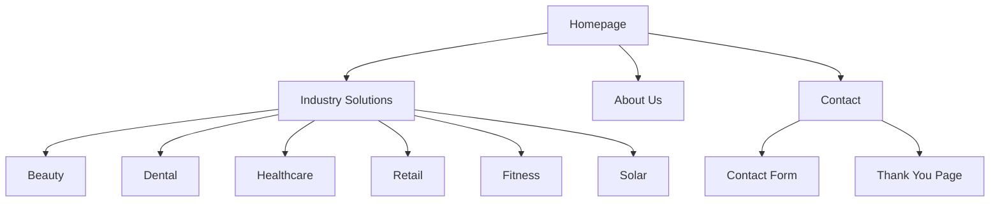
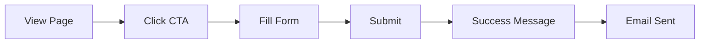

# Robofy UI/UX Specification

## Introduction

This document defines the user experience goals, information architecture, user flows, and visual design specifications for Robofy's user interface. It serves as the foundation for visual design and frontend development, ensuring a cohesive and user-centered experience with a futuristic and functional theme.

## Overall UX Goals & Principles

### Target User Personas
- **Small Business Owners**: Non-technical users in beauty, dental, healthcare, retail, fitness, and solar industries who need easy-to-use automation solutions.
- **Marketing Managers**: Users seeking AI-driven digital marketing tools with minimal setup.
- **AI Systems**: Automated content generation and CRM management systems.

### Usability Goals
- **Ease of learning**: New users can understand core offerings within 30 seconds via hero sections.
- **Efficiency of use**: Key actions (contact forms, navigation) completed in under 3 clicks.
- **Error prevention**: Clear validation and confirmations for all user inputs.
- **Memorability**: Consistent patterns across industry pages for easy recall.

### Design Principles
1. **Futuristic yet Functional**: Balance innovative visuals with practical usability.
2. **Performance First**: Ensure fast load times even with 3D elements.
3. **Accessibility by Default**: Design for all users from the start.
4. **Consistent Patterns**: Use familiar UI elements with futuristic twists.
5. **Progressive Disclosure**: Show only what's needed when it's needed.

## Information Architecture (IA)

### Site Map / Screen Inventory

### Navigation Structure
- **Primary Navigation**: Horizontal menu with industry dropdowns on desktop; hamburger menu on mobile.
- **Secondary Navigation**: Footer links for legal, social, and support pages.
- **Breadcrumb Strategy**: Not used due to flat structure; instead, use clear headings and back buttons.

## User Flows

### Lead Generation Flow
**User Goal**: Submit contact information to learn more about services.
**Entry Points**: Homepage CTA, industry page CTAs, footer contact link.
**Success Criteria**: Form submission with confirmation message and email notification.

**Flow Diagram**:

**Edge Cases & Error Handling**:
- Form validation errors with clear messages
- Network issues with retry mechanism
- Duplicate submissions prevention

### Industry Content Browsing
**User Goal**: Explore industry-specific solutions and case studies.
**Entry Points**: Homepage industry grid, navigation menu.
**Success Criteria**: Find relevant content quickly with clear paths to contact.

## Wireframes & Mockups

**Primary Design Files**: Designs will be created in Figma with a shared workspace for collaboration.

### Homepage Hero Section
**Purpose**: Immersive futuristic first impression with full-page Spline 3D scene.
**Key Elements**:
- Full-viewport Spline 3D animation
- Dynamic overlay with value proposition
- Mode toggle in navigation (glow effect)
- Subtle CTA button
**Interaction Notes**: 3D scene responds to scroll and cursor movement.
**Design File Reference**: `https://figma.com/file/robofy-homepage-hero`

### Industry Solutions Landing Pages
**Purpose**: Industry-specific hero sections with thematic Spline 3D scenes.
**Key Elements**:
- Tailored 3D animations per industry
- Vibrant accent colors in overlays
- Consistent navigation with mode toggle
**Design File Reference**: `https://figma.com/file/robofy-industry-pages`

### Contact Form Page
**Purpose**: Clean, functional form with futuristic touches.
**Key Elements**:
- Minimalist design with accent borders
- Real-time validation animations
- Success state with particle effects
**Design File Reference**: `https://figma.com/file/robofy-contact-forms`

## Component Library / Design System

**Design System Approach**: Custom Tailwind CSS-based system with extensions for futuristic aesthetics, supporting light/dark modes.

### Button Component
**Purpose**: Interactive elements for actions and CTAs.
**Variants**: Primary (vibrant accents), Secondary (outline), Ghost (minimal)
**States**: Default, hover, active, disabled, loading
**Usage Guidelines**: Use primary for main actions, secondary for less emphasis.

### Navigation Component
**Purpose**: Consistent navigation with mode toggle integration.
**Variants**: Desktop (horizontal), Mobile (hamburger)
**States**: Default, active link, dropdown open
**Usage Guidelines**: Include mode toggle as part of nav.

### Card Component
**Purpose**: Container for content snippets and showcases.
**Variants**: Default, elevated, interactive
**States**: Default, hover, focus
**Usage Guidelines**: Use for case studies, services, blog previews.

### Form Components
**Purpose**: Input fields with futuristic styling.
**Variants**: Text input, textarea, select, checkbox, radio
**States**: Default, focus, error, success
**Usage Guidelines**: Use accent colors for focus states.

## Branding & Style Guide

### Visual Identity
Futuristic, functional aesthetic focusing on AI automation and digital transformation.

### Color Palette
| Color Type | Hex Code | Usage |
|------------|----------|-------|
| Primary Background | #000000 | Dark mode background |
| Primary Background | #FFFFFF | Light mode background |
| Accent 1 | #007BFF | Primary buttons, key elements |
| Accent 2 | #00FF00 | Secondary actions, highlights |
| Accent 3 | #00FFFF | Tertiary elements, notifications |
| Success | #00CC00 | Positive feedback, confirmations |
| Warning | #FF9900 | Cautions, important notices |
| Error | #FF3333 | Errors, destructive actions |
| Neutral | #666666 | Text, borders, secondary elements |

### Typography
- **Primary Font**: 'Inter' for modern, clean look
- **Secondary Font**: 'Monospace' for code elements
- **Type Scale**:
  - H1: 2.5rem, Bold, Line Height 1.2
  - H2: 2rem, Bold, Line Height 1.3
  - H3: 1.5rem, Semi-Bold, Line Height 1.4
  - Body: 1rem, Regular, Line Height 1.5
  - Small: 0.875rem, Regular, Line Height 1.4

### Iconography
- **Icon Library**: Material Icons or custom SVG icons
- **Usage Guidelines**: Simple, recognizable icons with accent colors for interactivity.

### Spacing & Layout
- **Grid System**: 12-column grid with 16px gutters
- **Spacing Scale**: 8px increments (8px, 16px, 24px, 32px, etc.)

## Accessibility Requirements

### Compliance Target
**Standard**: WCAG 2.1 Level AA compliance

### Key Requirements
- **Visual**: Color contrast ratios min 4.5:1 for text, focus indicators with high contrast
- **Interaction**: Keyboard navigation, screen reader support, touch targets min 44x44px
- **Content**: Alternative text for images and 3D elements, logical heading structure, form labels

### Testing Strategy
Automated testing with Lighthouse and Axe, manual testing with screen readers and keyboard navigation.

## Responsiveness Strategy

### Breakpoints
| Breakpoint | Min Width | Max Width | Target Devices |
|------------|-----------|-----------|----------------|
| Mobile | 320px | 767px | Smartphones, small tablets |
| Tablet | 768px | 1023px | Tablets, large phones |
| Desktop | 1024px | 1439px | Laptops, small desktops |
| Wide | 1440px | - | Large monitors |

### Adaptation Patterns
- **Layout Changes**: Stack on mobile, hybrid on tablet, horizontal on desktop
- **Navigation Changes**: Hamburger on mobile, compact horizontal on tablet, full horizontal on desktop
- **Content Priority**: Focus on core content on mobile, balance on tablet, full content on desktop
- **Interaction Changes**: Touch-optimized on mobile, hybrid on tablet, cursor-based on desktop

## Animation & Micro-interactions

### Motion Principles
Smooth, purposeful animations that enhance usability without distraction.

### Key Animations
- **Page Transitions**: Fade/slide effects (300ms, ease-in-out)
- **Button Hovers**: Scale transform and color shift (200ms, ease-out)
- **Form Interactions**: Shake for errors (500ms, ease-in-out), checkmark for success (400ms, ease-out)
- **Mode Toggle**: Glowing morph transition (400ms, ease-in-out)
- **3D Interactions**: Hover effects like rotation or color shifts (300ms, ease-out)
- **Loading States**: Skeleton screens with shimmer (1.5s, linear)

## Performance Considerations

### Performance Goals
- **Page Load**: LCP < 2.5 seconds
- **Interaction Response**: FID < 100 milliseconds
- **Animation FPS**: 60fps
- **Layout Shift**: CLS < 0.1

### Design Strategies
- Lazy loading for 3D scenes and images
- Progressive enhancement for 3D elements
- Optimized assets (WebP, compressed 3D models)
- Critical CSS inlining
- Resource hinting (preload, preconnect)
- Caching strategy with CDN
- Performance budgets (e.g., < 2MB page size)

## Next Steps

### Immediate Actions
1. Review this specification with stakeholders for alignment.
2. Create high-fidelity mockups in Figma based on wireframes.
3. Develop interactive prototypes for key user flows.
4. Finalize Spline 3D designs for hero sections.
5. Schedule handoff meeting with development team.

### Design Handoff Checklist
- [x] All user flows documented and validated
- [x] Component inventory complete with variants and states
- [x] Accessibility requirements integrated
- [x] Responsive strategy clear for all screen sizes
- [x] Brand guidelines incorporated consistently
- [x] Performance goals established and strategies defined
- [x] Animation principles and micro-interactions specified
- [ ] Figma files organized with developer-friendly naming and layers

## Change Log
| Date | Version | Description | Author |
|------|---------|-------------|--------|
| 2025-08-22 | 1.0 | Initial UI/UX specification draft | Sally (UX Expert) |
