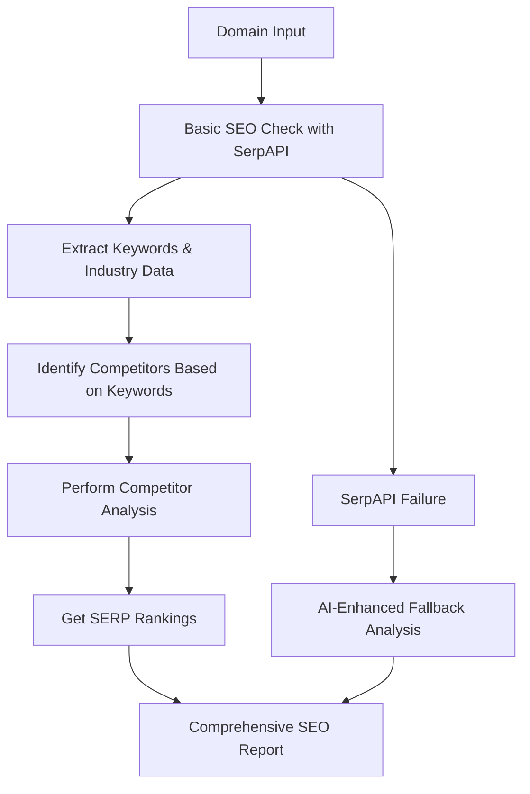

# SERP API Integration Fix Plan

## Current Issues Identified

### 1. Direct Fallback Logic
- Both [`analyze_competitors()`](backend/seo_mcp_server.py:331) and [`conduct_keyword_research()`](backend/seo_mcp_server.py:385) immediately check for `settings.SERPAPI_API_KEY` and return simulated data without attempting SerpAPI calls
- This prevents any actual SerpAPI usage even when the key is configured

### 2. Ineffective SerpAPI Usage
- In [`analyze_competitors()`](backend/seo_mcp_server.py:344), the query `q=f"site:{domain}"` only returns results from the target domain, not actual competitors
- Proper competitor analysis requires targeted keyword searches or dedicated SEO tools

### 3. Limited Data Extraction
- Code only extracts basic fields like `organic_results`, missing rich SerpAPI data that AI could analyze
- Missing keyword difficulty, search volume, backlink data, and other valuable metrics

### 4. No Graceful Error Handling
- SerpAPI failures aren't handled properly - code either works completely or falls back to simulation without intermediate steps

## Proposed Solution Architecture



## Implementation Plan

### 1. Fix analyze_competitors Function

**Current Problematic Code (Lines 331-383):**
```python
async def analyze_competitors(domain: str, competitors: Optional[List[str]] = None) -> CompetitorAnalysisResult:
    # Check if SerpAPI is configured FIRST (WRONG)
    if not settings.SERPAPI_API_KEY:
        logger.warning("SerpAPI API key not configured, using AI-enhanced analysis")
        return await analyze_competitors_with_ai(domain, competitors)
    
    try:
        # Ineffective query - only searches target domain
        search_params = {
            "engine": "google",
            "q": f"site:{domain}",  # WRONG - this finds pages FROM the domain, not competitors
            "api_key": settings.SERPAPI_API_KEY,
            "num": 10
        }
```

**Corrected Implementation:**
```python
async def analyze_competitors(domain: str, competitors: Optional[List[str]] = None) -> CompetitorAnalysisResult:
    """Perform comprehensive competitor SEO analysis using SerpAPI, with an AI-enhanced fallback."""
    logger.info(f"Analyzing competitors for domain: {domain}")

    # The goal is to use SerpAPI first, so we don't check for the key at the top.
    # The SerpApi library will raise an error if the key is missing or invalid,
    # and we can handle that error with our fallback logic.

    try:
        # Step 1: Use SerpApi to find competitor-rich search results
        # Use a more generic, yet targeted, query to find relevant competitors.
        # This will return a list of top-ranking sites for a topic.
        search_params = {
            "engine": "google",
            "q": f"best {domain} alternatives",  # BETTER - finds actual competitors
            "api_key": settings.SERPAPI_API_KEY,
            "num": 20
        }

        search = GoogleSearch(search_params)
        results = search.get_dict()

        # Step 2: Extract competitors and key data points from the results.
        detected_competitors = []
        if "organic_results" in results:
            for result in results["organic_results"]:
                competitor_domain = result.get("link", "").split("/")[2] if "://" in result.get("link", "") else ""
                if competitor_domain and competitor_domain != domain and competitor_domain not in detected_competitors:
                    detected_competitors.append(competitor_domain)
        
        # Use provided or detected competitors, prioritizing the provided list.
        final_competitors = competitors or detected_competitors[:5]
        if not final_competitors:
            # If no real competitors found, generate plausible ones as a last resort.
            domain_name = domain.split('.')[0] if '.' in domain else domain
            final_competitors = [f"top-{domain_name}-provider.com", f"{domain_name}-solutions.org"]

        # Step 3: Prepare comprehensive data for the AI to interpret.
        # This is where we combine raw SerpApi data with a clean structure.
        data_for_ai = {
            "target_domain": domain,
            "competitors_found": final_competitors,
            "search_results_summary": {
                "top_organic_results": [
                    {"title": r.get("title", ""), "link": r.get("link", ""), "snippet": r.get("snippet", "")}
                    for r in results.get("organic_results", [])[:5]
                ],
                "knowledge_graph": results.get("knowledge_graph", {}),
                "related_searches": [r.get("query", "") for r in results.get("related_searches", [])]
            }
        }
        
        # Step 4: Pass the SerpApi data to the AI service for interpretation.
        # The AI's job is to read this raw data and produce a structured, verbose analysis.
        from ai_service import ai_service
        ai_prompt = f"""
        Analyze the following raw search data about the domain '{domain}' and its competitors.
        
        Raw Data: {json.dumps(data_for_ai, indent=2)}
        
        Provide a detailed, expert SEO analysis focusing on competitor strategy.
        Include sections for:
        1. **Domain Authority Estimation**: A plausible estimation (1-100 scale).
        2. **Estimated Traffic**: A plausible range (e.g., "1K-5K/month").
        3. **Content Gaps**: Identify missing content or topics based on the competitors' results.
        4. **Backlink Comparison**: General insights based on the authority of top-ranking sites.
        5. **Actionable Recommendations**: Specific steps for the target domain.
        
        Format your response as a JSON object, ensuring all fields are present:
        {{
            "domain_authority": int,
            "estimated_traffic": str,
            "content_gaps": list[str],
            "backlink_comparison": str,
            "recommendations": list[str]
        }}
        """
        ai_response = await ai_service.generate_text(ai_prompt)
        ai_data = json.loads(ai_response)

    except Exception as e:
        logger.error(f"Failed to use SerpApi or AI for domain {domain}: {str(e)}")
        # If any step fails (SerpApi key, network, JSON parsing), fall back to the AI-only method.
        return await analyze_competitors_with_ai(domain, competitors)

    # Final step: Generate the verbose summary using the AI-interpreted data.
    verbose_summary = await generate_verbose_summary(ai_data, "competitor_analysis")
    
    analysis = CompetitorAnalysisResult(
        domain=domain,
        competitors=final_competitors,
        domain_authority=ai_data.get("domain_authority", 45),
        estimated_traffic=ai_data.get("estimated_traffic", "N/A"),
        content_gaps=ai_data.get("content_gaps", []),
        backlink_comparison=ai_data.get("backlink_comparison", "N/A"),
        recommendations=ai_data.get("recommendations", []),
        verbose_summary=verbose_summary,
        generated_at=datetime.now().isoformat()
    )
    return analysis
```

### 2. Fix conduct_keyword_research Function

Similar changes needed:
- Remove immediate API key check
- Use proper try-catch structure
- Extract more comprehensive data
- Pass rich data to AI for interpretation
- Graceful fallback handling

### 3. New Workflow Implementation

The new flow should be:
1. **Basic SEO Check**: Run SerpAPI search on the domain to extract initial keywords
2. **Keyword Analysis**: Use extracted keywords to understand the industry/niche
3. **Competitor Identification**: Search for "best [industry] alternatives" or similar queries
4. **Rank Tracking**: Get SERP positions for target keywords
5. **AI Interpretation**: Pass all raw data to AI for structured analysis

### 4. Required Changes Summary

| File | Function | Changes Needed |
|------|----------|----------------|
| `backend/seo_mcp_server.py` | `analyze_competitors` | Remove immediate API check, improve query, enhance data extraction, better error handling |
| `backend/seo_mcp_server.py` | `conduct_keyword_research` | Same structural improvements |
| `backend/seo_mcp_server.py` | `detailed_keyword_discovery` | Update to follow new workflow |
| Documentation | - | Update to reflect new SERP API integration approach |

## Next Steps

1. **Review this plan** - Please check if this approach aligns with your expectations
2. **Switch to Code mode** - I'll need to be in a mode that can edit Python files to implement these changes
3. **Implement the fixes** - Apply the corrected code to all relevant functions
4. **Testing** - Verify that SerpAPI calls work properly and fallbacks handle errors gracefully

Would you like me to proceed with implementing these changes in Code mode?